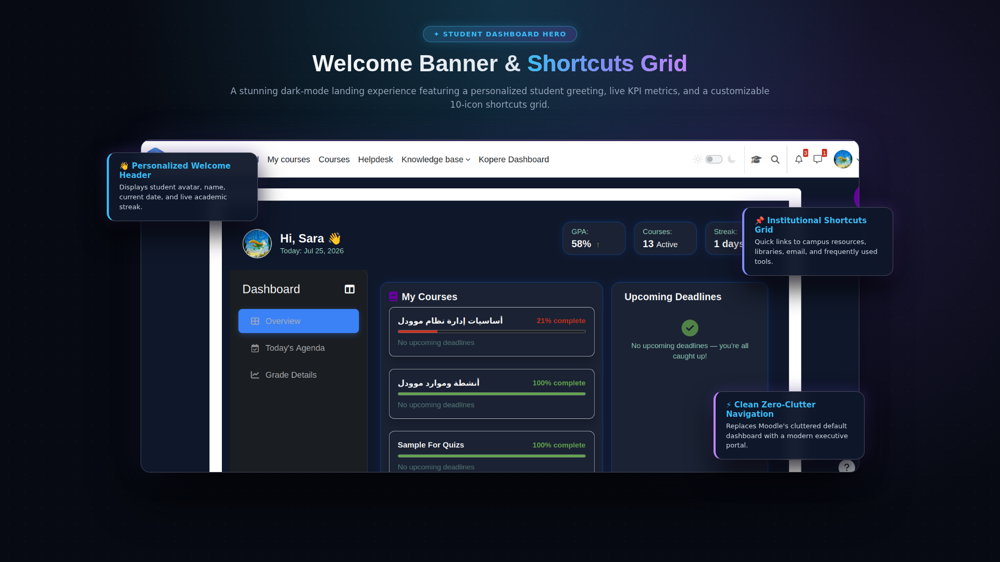
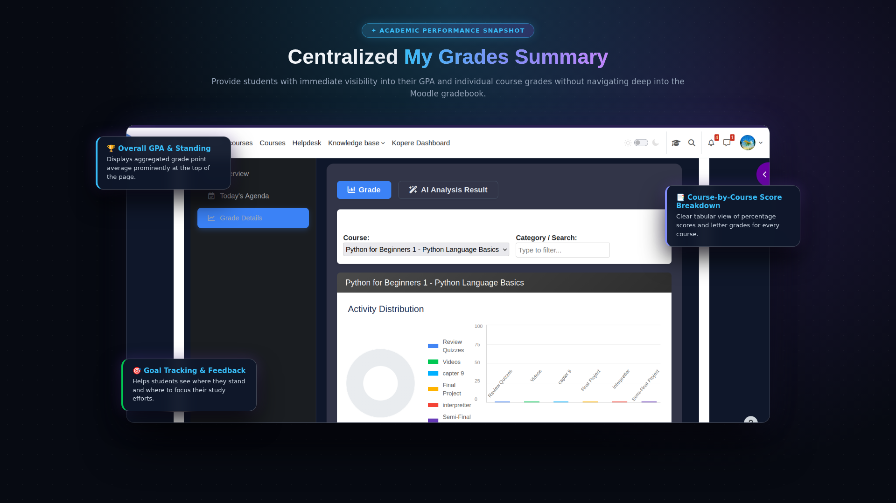
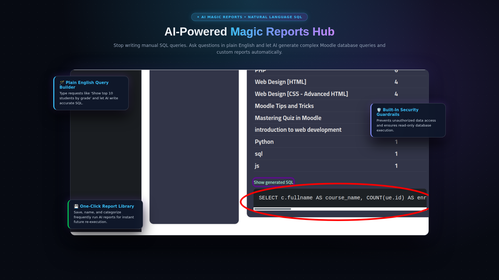
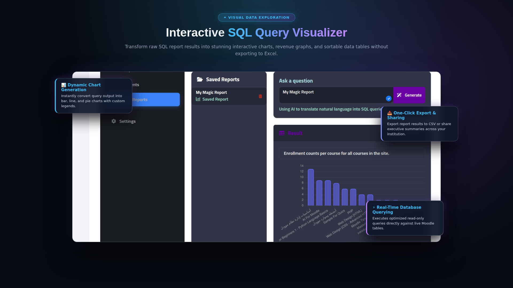
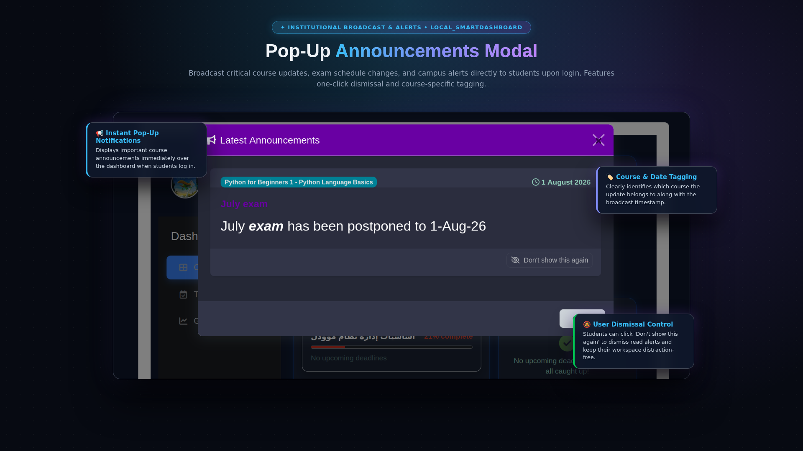

<p align="center">
  
</p>

<p align="center">
  <a href="https://moodle.org/plugins"></a>
  <a href="https://www.gnu.org/licenses/gpl-3.0"></a>
  <a href="https://moodle.org/plugins"></a>
  <a href="https://www.gnu.org/licenses/gpl-3.0"></a>
  <a href="#"></a>
  <a href="#"></a>
</p>

<p align="center">
  <strong>A modern, powerful, and intuitive all-in-one dashboard for Moodle.</strong><br>
  Built for <b>Students</b>, <b>Teachers</b>, and <b>Administrators</b> — with cross-course progress, deadline urgency timeline, centralized grading queue, and a beautiful dark/light interface.
</p>

---

## 📖 Complete Documentation & Guides

> 💡 **Looking for the comprehensive step-by-step user manual?** Check out our dedicated **[User Guide (USER_GUIDE.md)](./USER_GUIDE.md)** for in-depth role workflows, configuration tutorials, and advanced reporting examples.

---

## 💎 Community Edition vs. Pro Edition

Smart Dashboard is distributed under the **In-Place Drop-In Upgrade Model**. You can use this Community Edition 100% free forever, or upgrade seamlessly to Pro at any time without losing any settings, user configurations, or data.

| Feature | 🆓 Community Edition (Free) | 💎 Pro Edition (SmartLearn) |
|---|:---:|:---:|
| **Personalized Student Banner & Avatar** | ✅ | ✅ |
| **Cross-Course Progress Cards** | ✅ | ✅ |
| **Color-Coded Deadline Urgency Timeline** | ✅ | ✅ |
| **My Grades Academic Snapshot** | ✅ | ✅ |
| **Centralized Teacher Grading Queue** | ✅ | ✅ |
| **System Enrollment & Category Statistics** | ✅ | ✅ |
| **Dark & Light Adaptive Theme** | ✅ | ✅ |
| **Multilingual (English, Spanish, Arabic RTL)** | ✅ | ✅ |
| **AI Magic Reports (Natural Language to SQL)** | ❌ | ✅ |
| **Parent & Mentor 360° Portal (Radar & Heatmaps)** | ❌ | ✅ |
| **Revenue & Payment Analytics** | ❌ | ✅ |
| **Automated n8n Webhook Alerts (Slack, SMS, Teams)**| ❌ | ✅ |
| **Full 6-Rule At-Risk Retention Engine** | ❌ | ✅ |

👉 **[Explore Smart Dashboard Pro at SmartLearn.education](https://smartlearn.education)**

---

## 🌟 Features at a Glance

### Course Overview & Banner
- Course cards with student counts & custom images
- Admin category browser with enrollment statistics
- Personalized student welcome banner with avatar and shortcut icons grid (up to 10 customizable links)

### Student Progress & Deadlines
- Cross-course progress and completion tracking across enrolled courses
- Detailed per-student activity completion drill-down
- Filterable student gradebooks list & **My Grades Summary** snapshot
- **Color-Coded Deadline Timeline**: Upcoming assignments and quizzes categorized by urgency (**Critical**, **Due Soon**, **Upcoming**)
- Exportable CSV datasets & instant AI grade performance analysis

### Grading & Agenda
- Centralized pending grading queues across all teaching courses
- Homework/assignments breakdown with due dates
- **Today's Agenda (Daily Plan)**: Syncs student task schedule dynamically (integrates with Moodle Adaptive Study Plans `mod_adaptiveplan`)

### Parent & Mentor 360° Portal
- **Mentee Switcher**: Easily toggle between multiple assigned students or mentees
- **Program Filtering**: Dynamically filter mentees based on enrolled programs (via `enrol/programs` integration)
- **Visual Analytics**: View Grade Progression charts, Subject Mastery radar graphs, and Weekly Engagement Heatmaps
- **KPI At-Risk Indicators**: Study streak counters, total interactions, and immediate early-warning badges

### System Analytics
- System-wide enrollment statistics
- Category-level breakdown graphs and performance tracking
- Student-to-teacher ratio visualizations
- Exportable CSV records

### At-Risk Student Alert (Risk Tracking)
- Modular risk assessment via 6 `smartdashboardrule` subplugins:
  - `loginrecency`: Monitors inactivity thresholds
  - `coursecompletion`: Tracks stalled progress
  - `grades` & `safetynet70`: Flags low average scores
  - `overdue` & `adaptiveplan`: Identifies missed deadlines
- Track student engagement metrics (login recency, completion, grades, overdue status, adaptive plans)
- Integrates with n8n webhooks for instant SMS/Email/Slack external alerts

### AI Magic Reports & SQL Hub
- Custom reporting wizard for admins
- **Natural Language to SQL**: Ask questions in plain English and let AI generate complex SQL queries automatically via `local_aihub` (with `core_ai` fallback)
- Transform query results into dynamic charts, revenue graphs, and KPI tables
- Save, load, execute, and delete custom insights

### Payment Analytics
- Actual vs. estimated revenue tracking with interactive comparison charts
- Per-category revenue charts & ROI filtering
- Time-range filters & currency toggles
- Exportable CSV records

### Centralized News & Announcements
- Consolidates announcements from site and course news forums
- Instant AJAX dismissal and notification badges

### Settings & Configuration
- Custom shortcut icons configuration (name, class, URL)
- Dashboard Replacement redirect options (redirect specific roles from default `/my/`)
- Payment calculation mode settings
- n8n webhook settings (URL & token) for risk notifications
- Modular rule calculation thresholds

### Security & Privacy
- Fully compliant with Moodle's **External Services API**
- Implements Moodle **Privacy API** core standards
- Secure parameter validation and strict capability checks

### Internationalization
- Available out-of-the-box in **English**, **Spanish**, and **Arabic**
- Full `get_string()` integration for easy localization
- RTL (Right-to-Left) language layout support

---

## ⚡ Workflow Transformation: Moodle Default vs. Smart Dashboard

| Task | Moodle Default Workflow | Smart Dashboard Workflow | Time Saved |
|---|---|---|---|
| **Check Pending Grading** | Click course → Click assignment → Check submissions → Repeat 10+ times | Open Smart Dashboard → View **Grading Queue** across all courses | **85% Faster** |
| **Identify At-Risk Students** | Export logs to Excel → Calculate login recency & grade averages manually | Open **At-Risk Alerts** → Instant risk score badges & n8n webhook triggers | **95% Faster** |
| **Custom Data Insights** | Write complex custom SQL queries in database admin tools | Use **AI Magic Reports** → Type natural language question & view chart | **90% Faster** |
| **Student Daily Plan** | Check each course calendar separately | Open **Today's Agenda** → Unified daily study plan | **80% Faster** |

---

## 🎬 Visual Showcase & Persona Walkthrough

### 1. 🎓 Student Experience & Personalized Learning Hub
An all-in-one student portal featuring dynamic greetings, customizable shortcuts, cross-course completion tracking, and color-coded deadline urgency.

<table>
  <tr>
    <td width="50%" align="center" valign="top">
      <br>
      <strong>Welcome Banner & Course Progress Cards</strong><br>
      <em>Dynamic student greeting, custom quick-access shortcuts, and real-time completion tracking across enrolled courses.</em>
    </td>
    <td width="50%" align="center" valign="top">
      <br>
      <strong>Color-Coded Deadline Timeline</strong><br>
      <em>Upcoming assignments and quizzes categorized by urgency (Critical, Due Soon, Upcoming).</em>
    </td>
  </tr>
  <tr>
    <td width="50%" align="center" valign="top">
      <br>
      <strong>My Grades Summary & Snapshot</strong><br>
      <em>Instant academic performance overview and grade averages across all enrolled subjects.</em>
    </td>
    <td width="50%" align="center" valign="top">
      <br>
      <strong>Course Activity Drill-Down</strong><br>
      <em>Inspect detailed per-activity completion status and submission requirements.</em>
    </td>
  </tr>
  <tr>
    <td colspan="2" align="center" valign="top">
      <br>
      <strong>Today's Agenda & Adaptive Study Plan</strong><br>
      <em>Daily study task schedules synchronized with Moodle Adaptive Study Plans.</em>
    </td>
  </tr>
</table>

### 2. 👩‍🏫 Teacher Portal & At-Risk Retention System
Empower educators with a centralized grading queue across all taught courses and proactive early-warning retention badges.

<table>
  <tr>
    <td width="50%" align="center" valign="top">
      <br>
      <strong>Centralized Grading Queue</strong><br>
      <em>Single-page grading queue consolidating pending submissions across every taught course.</em>
    </td>
    <td width="50%" align="center" valign="top">
      <br>
      <strong>At-Risk Early Warning & Retention Dashboard</strong><br>
      <em>Proactively detect struggling students using modular risk scores before they drop out.</em>
    </td>
  </tr>
  <tr>
    <td colspan="2" align="center" valign="top">
      <br>
      <strong>Student Completion & Engagement Drill-Down</strong><br>
      <em>Detailed tracking of student login recency, activity participation, and course milestones.</em>
    </td>
  </tr>
</table>

### 3. 👨‍👩‍👧 Parent & Mentor 360° Portal
Give parents and mentors complete transparency into mentee performance with visual charts, radar graphs, and engagement heatmaps.

<table>
  <tr>
    <td width="50%" align="center" valign="top">
      <br>
      <strong>Mentee Switcher & Program Filtering</strong><br>
      <em>Toggle between assigned mentees and filter by program enrollment dynamically.</em>
    </td>
    <td width="50%" align="center" valign="top">
      <br>
      <strong>Grade Progression Analytics Chart</strong><br>
      <em>Track academic improvement over time across all enrolled subjects.</em>
    </td>
  </tr>
  <tr>
    <td width="50%" align="center" valign="top">
      <br>
      <strong>Subject Mastery Radar Graph</strong><br>
      <em>Multi-dimensional competency breakdown showing student strengths and growth areas.</em>
    </td>
    <td width="50%" align="center" valign="top">
      <br>
      <strong>Weekly Engagement Heatmap</strong><br>
      <em>Visualize daily login activity, study streaks, and platform interaction density.</em>
    </td>
  </tr>
  <tr>
    <td colspan="2" align="center" valign="top">
      <br>
      <strong>KPI At-Risk Indicators & Alerts</strong><br>
      <em>Immediate early-warning badges and intervention alerts for mentors and parents.</em>
    </td>
  </tr>
</table>

### 4. 🏢 Administrator Hub & Revenue Analytics
Save hours every week with executive system health oversight, category financial analytics, and modular rule configuration.

<table>
  <tr>
    <td width="50%" align="center" valign="top">
      <br>
      <strong>System-Wide Enrollment & Category Performance</strong><br>
      <em>Real-time enrollment counts, course completion rates, and category statistics.</em>
    </td>
    <td width="50%" align="center" valign="top">
      <br>
      <strong>Estimated vs. Actual Revenue Analytics</strong><br>
      <em>Financial tracking with interactive comparison charts and category-level ROI filtering.</em>
    </td>
  </tr>
  <tr>
    <td colspan="2" align="center" valign="top">
      <br>
      <strong>System Configuration & Modular Rule Settings</strong><br>
      <em>Manage risk calculation thresholds, payment modes, and API integrations seamlessly.</em>
    </td>
  </tr>
</table>

### 5. 🔮 AI Magic Reports & SQL Insights Hub
Transform natural language questions into executable SQL queries and dynamic visual charts instantly.

<table>
  <tr>
    <td width="50%" align="center" valign="top">
      <br>
      <strong>Natural Language to SQL Query Generator</strong><br>
      <em>Ask questions in plain English and let AI generate complex SQL queries automatically via AI Hub.</em>
    </td>
    <td width="50%" align="center" valign="top">
      <br>
      <strong>Interactive Visualizers & Saved Reports</strong><br>
      <em>Transform query results into dynamic charts, revenue graphs, and save custom reports securely.</em>
    </td>
  </tr>
</table>

### 6. 📣 Centralized News, Announcements & Notifications
Stay informed with real-time announcements from site and course news forums with AJAX dismissal.

<p align="center">
  <br>
  <strong>Centralized News & Announcement Alerts</strong><br>
  <em>Consolidated site and course announcements with instant AJAX dismissal and notification badges.</em>
</p>

---

## 🚀 Installation

### Option 1 — Download ZIP (Recommended)
1. Download the latest release ZIP from the [Releases](../../releases) page.
2. Log into Moodle as an Administrator and navigate to **Site Administration → Plugins → Install plugins**.
3. Upload the ZIP file and follow the on-screen prompts.

### Option 2 — Git Clone
If you have access to the server terminal, navigate to your Moodle installation:

```bash
cd /path/to/moodle/local
git clone https://github.com/Smartlearn-edu/moodle_local_smartdashboard.git smartdashboard
```
Then visit **Site Administration → Notifications** to complete the install.

> ⚠️ **Important:** The folder inside `/local/` must be named **`smartdashboard`**.

---

## 🔧 Usage & Role Access Breakdown

After installation, users can navigate to the Smart Dashboard via:

```text
https://your-site.com/local/smartdashboard/
```

### Role Access Breakdown

| Role | What you see |
|---|---|
| **Student** | Welcome banner, customizable shortcuts grid, cross-course progress, color-coded deadline timeline, grades summary, and daily agenda |
| **Teacher** | Course overview, student progress & grades, centralized grading queue, at-risk early warning badges, and daily plan |
| **Parent / Mentor** | Mentee switcher, program filtering, grade progression charts, subject mastery radar graphs, weekly engagement heatmaps, and KPI at-risk alerts |
| **Manager** | All of the above + category analytics, system stats |
| **Admin** | Full access including payment analytics, settings config, modular rules, and AI Magic Reports |

### Adding Moodle Blocks to the Dashboard

By default, some Moodle blocks restrict themselves only to course pages or the standard Moodle dashboard. To make a block available to be added to the Smart Dashboard, you need to add the dashboard's specific page type (`local-smartdashboard-*`) to the block's allowed formats.

**Example: Modifying a block's code**
1. Open the block's main PHP file: `blocks/<blockname>/block_<blockname>.php`
2. Locate the `applicable_formats()` function.
3. Add `'local-smartdashboard-*' => true,` to the returned array.

```php
public function applicable_formats() {
    return [
        'course-view'            => true,
        'site'                   => true,
        'my'                     => true,
        'local-smartdashboard-*' => true, // <-- Add this line
    ];
}
```
> **Note:** Make sure to **Purge all caches** (*Site administration → Development → Purge caches*) after saving the file to see the block in the "Add a block" menu!

---

## 📋 Requirements

| Requirement | Supported Version |
|---|---|
| **Moodle** | 4.0, 4.1, 4.2, 4.3, 4.4, 4.5, 5.0+ |
| **PHP** | 7.4, 8.0, 8.1, 8.2, 8.3+ |
| **Browser** | Modern browsers with CSS Grid & Backdrop Filter support |
| **Optional Integrations** | `local_aihub` / Moodle Core AI, `mod_adaptiveplan`, `enrol_programs` |

---

## 🌐 API Reference

All functions are securely exposed via Moodle's **External Services API** (`local_smartdashboard_webservice`):

- `local_smartdashboard_get_cross_course_progress` - Student progress data across courses
- `local_smartdashboard_get_student_detailed_progress` - Detailed activity completion for one student
- `local_smartdashboard_get_grading_overview` - Assignments needing grading
- `local_smartdashboard_get_system_analytics` - System-wide enrollment analytics for admin/managers
- `local_smartdashboard_get_payment_analytics` - Revenue and payment analytics
- `local_smartdashboard_save_dashboard_settings` - Save dashboard setting preferences
- `local_smartdashboard_get_dashboard_settings` - Retrieve current dashboard configurations
- `local_smartdashboard_get_cross_course_grades` - Student grades data across courses
- `local_smartdashboard_get_magic_insight` - Get AI-generated custom reports insight and SQL query via AI Hub
- `local_smartdashboard_save_magic_report` - Save a custom magic report configuration
- `local_smartdashboard_get_saved_reports` - List saved magic reports
- `local_smartdashboard_delete_magic_report` - Delete a saved magic report configuration
- `local_smartdashboard_get_programs` - Get list of programs and associated course IDs (`enrol/programs`)
- `local_smartdashboard_dismiss_announcement` - Dismiss a dashboard news announcement
- `local_smartdashboard_get_daily_plan` - Get the student's daily study plan (adaptive plan integration)
- `local_smartdashboard_get_risk_data` - Get at-risk student engagement tracking data
- `local_smartdashboard_send_n8n_data` - Send webhook payloads to external n8n automation servers
- `local_smartdashboard_test_ai` - Test AI integration for automated grade analysis

---

## 🗂️ Plugin Architecture

```
smartdashboard/
├── amd/
│   ├── src/main.js                    # Frontend interactive logic (AMD module)
│   └── build/main.min.js             # Compiled minified build
├── classes/
│   ├── external/
│   │   ├── analytics.php             # Core analytics & progress endpoints
│   │   ├── grading.php               # Grading queue API
│   │   ├── magic_analytics.php       # AI Magic Reports & SQL generator
│   │   ├── risk.php                  # At-Risk student tracking API
│   │   ├── n8n_webhook.php           # n8n webhook external integrations
│   │   └── announcements.php         # News & announcement dismissal API
│   └── output/
│       └── dashboard.php             # Moodle renderable output class
├── db/
│   ├── services.php                  # Web service function definitions
│   └── subplugins.json               # Subplugin definition for smartdashboardrule
├── rules/                            # Modular At-Risk assessment rules
│   ├── loginrecency/                 # Login inactivity detector
│   ├── coursecompletion/             # Stalled progress detector
│   ├── grades/                       # Low grade detector
│   ├── overdue/                      # Overdue assignment detector
│   ├── adaptiveplan/                 # Adaptive study plan risk detector
│   └── safetynet70/                  # 70% safety net score detector
├── lang/
│   ├── en/local_smartdashboard.php   # English language pack
│   ├── ar/local_smartdashboard.php   # Arabic language pack (RTL)
│   └── es/local_smartdashboard.php   # Spanish language pack
├── templates/
│   └── dashboard.mustache            # Mustache UI layout template
├── .github/
│   └── screenshots/                  # Interface reference images
├── index.php                         # Dashboard entry point
├── styles.css                        # Vanilla CSS dark mode styling & glassmorphism
├── USER_GUIDE.md                     # Comprehensive User & Administration Guide
└── version.php                       # Plugin metadata
```

---

## 🤝 Contributing

We welcome community contributions to make Smart Dashboard even better!
1. **Fork** the repository.
2. Create a **Feature Branch** (`git checkout -b feature/amazing-feature`).
3. **Commit** your changes (`git commit -m 'Add amazing feature'`).
4. **Push** to the branch (`git push origin feature/amazing-feature`).
5. Open a **Pull Request**.

---

## 📄 License & Credits

Licensed under the [GNU General Public License v3.0](https://www.gnu.org/licenses/gpl-3.0.html).

<p align="center">
  Made with ❤️ by <a href="https://smartlearn.education"><strong>SmartLearn Education</strong></a><br>
  <em>Transforming Moodle from a learning platform into a decision-making platform.</em>
</p>

